# AIEN Complete System Architecture
## Universal Local AI Runtime, Heterogeneous Compute Fabric, Skills/Tools, J-Space, Security, Memory, Provenance, and Self-Improvement

**Document status:** Architecture RFC / implementation roadmap  
**Snapshot date:** September 22, 2026  
**Primary composition root reviewed:** `aien-dev/aien-sovereign-core`  
**Current public `main` snapshot reviewed:** `cacf2264b52cac20ba0ac6aee55fcde9110d97b6`  
**Naming convention:** Physical hosts are always referred to as **Machine 1**, **Machine 2**, **Machine 3**, and so on. Hardware type is metadata, not identity.

---

# 1. Executive Summary

AIEN should become a **single logical AI system that can use every compatible machine, accelerator, model, skill, tool, memory store, and verifier available to it without making any one hardware vendor, model vendor, cloud service, or protocol the center of the architecture**.

The project already contains unusually strong pieces:

- a native Rust runtime spine,
- scheduler and sequence lifecycle,
- branchable/paged KV state,
- native transformer execution,
- Unix-domain-socket operator control,
- Cortex memory,
- AEGIS policy enforcement,
- signed evaluation receipts and TPM-oriented signing primitives,
- RSI candidate evaluation and promotion,
- multiple Rust MCP servers,
- benchmark/provenance infrastructure,
- cockpit/operator interfaces,
- harness/debugger/inquisitor subsystems,
- model adapters,
- and a growing set of real effect integrations.

The largest remaining problem is no longer “can AIEN run inference?” It is **composition**.

AIEN still needs one canonical layer that answers all of the following:

1. **What work needs to happen?**
2. **What skill or tool can perform it?**
3. **Which Machine can perform it?**
4. **Which model or accelerator should be used?**
5. **Can the work be explored in parallel branches?**
6. **What state belongs to each branch?**
7. **What effects are permitted?**
8. **How do we prove what actually happened?**
9. **What should be remembered?**
10. **How should the system improve from the result?**

The target architecture is therefore:

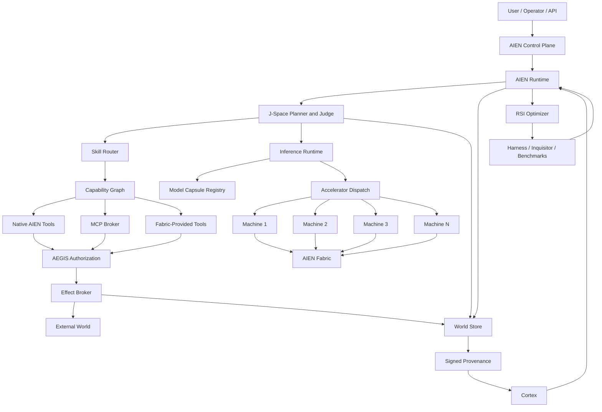

The central design principle is:

> **AIEN is one logical runtime. Machines are interchangeable capability providers. Models are interchangeable inference providers. MCP is an adapter. Tools are atomic capabilities. Skills are composed procedures. J-Space is the branch-and-judge planning substrate. Worlds hold state. AEGIS authorizes. The Effect Broker performs irreversible actions. Provenance proves. Cortex remembers. RSI improves.**

---


# 1A. Resolved Architecture Decisions After Sovereign Manifesto Review

The `open-humanity/docs/SOVEREIGN_MANIFESTO.md` establishes several architectural invariants that directly affect MCP, secrets, Fabric placement, and speculative execution:

- local-first execution,
- compiled Rust/Mojo core services,
- zero telemetry,
- zero plaintext secrets on disk,
- hardware-backed vaulting,
- durable memory,
- encrypted peer cooperation.

The following decisions are therefore **closed** for the target architecture.

## Decision 1: `aien-mcp` lives inside `aien-sovereign-core`

Canonical location:

```text
aien-sovereign-core/
└── crates/
    └── aien-mcp/
```

Do **not** create a separate canonical MCP repository first.

Reasons:

1. MCP is part of AIEN's runtime capability plane, not an independent product.
2. It must share canonical types with `aien-capability`, `aien-policy`, `aien-vault`, `aien-fabric`, `aien-world`, and provenance.
3. Keeping it in the composition root prevents another source-of-truth split.
4. Existing MCP implementations in `spark-debugger` and `aien-harness` should migrate into adapters/tests around `aien-mcp`.
5. A separate public SDK crate or mirror can be published later from the canonical source if external adoption warrants it.

Do not start this work by mixing it into unrelated local edits on `fix/golden-path-gaps`. Create a clean feature branch from the appropriate synchronized base once the golden-path work is committed or isolated.

Recommended branch:

```text
feat/aien-mcp-broker
```

## Decision 2: AEGIS applies to every capability provider

Every tool invocation crosses the same canonical authorization envelope regardless of provider:

```text
Native Tool
MCP Tool
Fabric Tool
WASM Tool
Process Tool
HTTP Tool
        │
        ▼
Capability Invocation
        │
        ▼
AEGIS
        │
        ├── deny
        └── allow
              │
              ▼
          Executor
```

This does **not** mean every read operation requires human approval.

It means every provider enters the same policy boundary. Policy may deterministically auto-allow safe/read-only operations.

The result is one policy model and one receipt family rather than separate trust models for MCP, native tools, and remote Machines.

The MCP broker **routes**. It does not become an alternative policy authority.

## Decision 3: Third-party servers may request environment variables, but AIEN configuration never stores the plaintext value

Third-party compatibility requires handling servers that expect environment variables such as:

```text
GITHUB_TOKEN
DATABASE_URL
API_KEY
```

AIEN should accept the **binding requirement**, not a plaintext value.

Example:

```rust
CredentialRef {
    provider: CredentialProvider::Vault,
    name: "github.operator",
    scope: CredentialScope::MachineResolvable,
    delivery: CredentialDelivery::ChildEnv {
        variable: "GITHUB_TOKEN",
    },
}
```

The stored configuration contains only the reference.

At execution time:

```text
ToolCall
   ↓
AEGIS
   ↓
Fabric placement
   ↓
MCP Broker on selected Machine
   ↓
Vault resolve
   ↓
launch one child with one ephemeral variable
   ↓
child exits
   ↓
credential value discarded
```

The model, J-Space state, tool arguments, World records, logs, Cortex, and provenance receipts never contain the resolved secret.

### Important limitation

A bearer token must exist in plaintext **somewhere in volatile memory** when an HTTP client or legacy child process actually authenticates with it.

Therefore the realistic invariant is:

> No plaintext secret at rest, in configuration, prompts, logs, receipts, or long-lived caches; plaintext is materialized only at the smallest possible execution boundary for the shortest possible time.

Preferred delivery order:

1. broker-owned authentication, where the child never sees the token;
2. short-lived OAuth/access token owned by the broker;
3. inherited file descriptor / pipe / local socket when supported;
4. call-scoped child environment variable only for legacy compatibility.

Environment-variable delivery should be tagged as a higher exposure class.

## Decision 4: Credential scope participates in Fabric placement

A TPM-backed vault is physically local.

A credential that exists only on one Machine cannot magically resolve elsewhere.

Do not hard-code a Machine ID into every semantic tool request. Instead, make **credential scope** part of placement constraints.

```rust
pub enum CredentialScope {
    FabricResolvable,
    MachineBound(MachineId),
    OperatorBound(OperatorId),
    SessionBound(SessionId),
}
```

Resolution:

```text
Tool requires github.operator
        ↓
Capability Graph
        ↓
Credential Resolver
        ↓
Which Machines can satisfy it?
        ↓
Fabric Scheduler
        ↓
eligible Machine selected
```

If Machine 2 cannot resolve the required credential, Machine 2 is not an eligible placement.

This is a scheduling constraint, not a late runtime surprise.

## Decision 5: Every tool declares effect semantics before J-Space may route it

J-Space must not infer side effects from a tool name.

Each tool declares an explicit effect set.

Recommended model:

```rust
bitflags! {
    pub struct ToolEffects: u32 {
        const PURE                 = 0;
        const READ_FILESYSTEM      = 1 << 0;
        const READ_NETWORK         = 1 << 1;
        const SPAWN_PROCESS        = 1 << 2;
        const WORLD_MUTATION       = 1 << 3;
        const LOCAL_EPHEMERAL      = 1 << 4;
        const EXTERNAL_WRITE       = 1 << 5;
        const EXTERNAL_IRREVERSIBLE= 1 << 6;
        const SECRET_BEARING       = 1 << 7;
    }
}
```

J-Space policy:

| Effect type | Speculative J-Space execution |
|---|---|
| Pure | Yes |
| Read-only | Yes |
| Local ephemeral | Yes, sandboxed |
| Process spawn | Yes when sandboxed and bounded |
| World mutation | Yes, but only inside a draft World |
| External write | Stage intent only until winner |
| External irreversible | Never execute on speculative branch |
| Secret-bearing | Only through brokered isolated execution |

Example: `debug_scan` is not simply "read-only" because it may spawn local checks and probe services. Its descriptor should declare the actual operations, for example:

```text
READ_FILESYSTEM
READ_NETWORK
SPAWN_PROCESS
LOCAL_EPHEMERAL
```

That lets J-Space execute it safely as a bounded evaluator without treating it as an externally visible write.

The universal rule is:

> J-Space may explore freely inside reversible Worlds. External reality changes only after selection, AEGIS authorization, and commit through the Effect Broker.

## Decision 6: `aien-mcp` owns the session. The Effect Broker owns externalization.

The live MCP session is private to `aien-mcp`. J-Space receives a `CapabilitySnapshot` and never receives `McpSession`, a credential, or a way to call `execute_effect`.

Discovery, initialization, `tools/list`, health, and catalog refresh are a discovery plane. They carry no tool-effect authority. A speculative branch may refresh a provider the Capability Graph has already admitted. Admitting a new server is enrollment, outside that lane.

`tools/call` is allowed during speculation only when `speculation_safe` is true. That is the highest-bit class of the tool's declared `ToolEffects`:

| Class | Speculative lane |
|---|---|
| Pure, ReadOnly | May run |
| LocalEphemeral, including process spawn | May run only inside a sandbox |
| WorldMutation, ExternalWrite, ExternalIrreversible | Stage an `EffectIntent`. Do not call the provider. |

`SECRET_BEARING` does not by itself forbid speculation. The session owner materializes the credential. The branch receives the tool result.

A preview, quote, validation, or dry-run is a separate tool. An irreversible tool has no hidden pretend mode.

After the winning World is frozen, AEGIS is the only constructor of `AuthorizedEffect`. The Effect Broker passes that value to `aien-mcp`. The same warm session performs the call when the authorized catalog digest still matches the live catalog. A changed catalog returns `StaleCapability` and must be re-planned. A reconnect that preserves the digest may proceed.

The broker records the `EffectId` before the provider call. A completed effect is replayed from that record. An uncertain result is reconciled and is not sent again.

```text
aien-mcp            owns the session
Capability Graph    owns the semantic description
J-Space             owns speculation and selection
AEGIS               owns permission
Effect Broker       owns authority to externalize
World               owns committed state
```

The first code for this boundary is `crates/aien-capability` and `crates/aien-mcp` on `feat/aien-mcp-broker`. `McpWire` is the attachment point for `rmcp`. The hand-written `spark-debugger` and `spark-harness` servers stay compatibility fixtures.

---

# 2. Architectural Principles

## 2.1 Hardware must not define AIEN

AIEN must not require CUDA, NVIDIA, Apple, AMD, a cloud provider, or a single machine.

The runtime should depend only on a hardware-neutral accelerator interface.

A Machine advertises capabilities such as:

```rust
pub struct MachineCapabilities {
    pub machine_id: MachineId,
    pub cpu_arch: CpuArch,
    pub cpu_cores: u16,
    pub memory_total_bytes: u64,
    pub memory_available_bytes: u64,
    pub accelerators: Vec<AcceleratorCaps>,
    pub supported_dtypes: DTypeSet,
    pub models_cached: Vec<ModelDigest>,
    pub tool_providers: Vec<ToolProviderId>,
    pub thermal_state: ThermalState,
    pub power_state: PowerState,
}
```

The scheduler should reason over capabilities, not brand names.

---

## 2.2 One logical system, many physical processes

AIEN should **not** attempt to stretch one operating-system process or one address space across multiple machines.

Instead:

- every Machine runs an `aien-node`,
- all Machines participate in one logical Fabric,
- state identifiers are global,
- memory ownership remains local,
- work can move,
- failed Machines can be replaced,
- content is addressed by digest,
- and state can be reconstructed from durable roots.

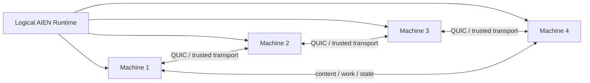

---

## 2.3 Tools are not skills

**Tool:** one atomic capability.

Examples:

- `filesystem.read`
- `filesystem.write`
- `process.execute`
- `git.diff`
- `git.commit`
- `mail.send`
- `browser.navigate`
- `cortex.search`
- `database.query`

**Skill:** a reusable procedure that can invoke multiple tools and can contain planning, success criteria, verification rules, and J-Space strategy.

Examples:

- `software.debug.rust`
- `software.review.pull_request`
- `software.implement.feature`
- `research.deep`
- `communication.answer_email`
- `operations.release`

This distinction must become canonical.

---

## 2.4 MCP is compatibility, not the core architecture

MCP is useful and important, but AIEN should not make the internal runtime depend on MCP semantics.

The canonical path should be:

```text
AIEN Capability ABI
    ├── Native Tool adapter
    ├── MCP adapter
    ├── HTTP/OpenAPI adapter
    ├── WASM Component adapter
    ├── Process adapter
    └── Fabric Remote Tool adapter
```

The model sees **AIEN capabilities**, not raw MCP topology.

---

## 2.5 Effects are transactional

Models, skills, tools, and J-Space branches should be able to propose actions.

Only a dedicated effect boundary should perform irreversible external actions.

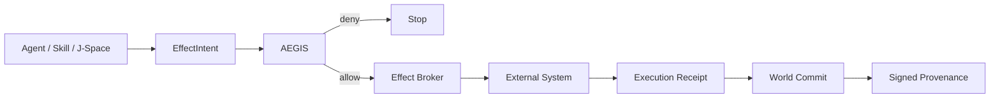

---

## 2.6 Memory is not execution state

Cortex should remember durable knowledge and evidence.

Worlds should represent branchable runtime state.

KV state should represent inference state.

J-Space should represent candidate/evaluation/search state.

They should reference one another by stable IDs, not collapse into one database.

---

# 3. Current AIEN Project: What Exists Today

This section distinguishes current implementation from the target architecture.

## 3.1 `aien-sovereign-core`

Current workspace members include:

- `aien-cli`
- `spark-cockpit-rs`
- `cortex-rs`
- `spark-hive`
- `spark-supervisor`
- `spark-discord-hub`
- `spark-debugger`
- `spark-harness`
- `spark-dream`
- `spark-adapters`
- `spark-crumbs`
- `spark-inquisitor`
- `spark-max-cabi`
- `spark-max-rs`
- `cortex-encoder-rs`
- `spark-mail-rs`
- `spark-harvester`
- `spark-aegis`
- `aien-inference-abi`
- `aien-kv-cache`
- `aien-scheduler`
- `aien-security`
- `aien-platform`
- `aien-platform-linux`
- `aien-runtime`
- `rad-id-sync`
- `aien-inference-protocol`
- `aien-inference-runtime`

The current public `main` has already connected native chat to the runtime socket and connected the native runtime to scheduler/KV/streaming paths.

### Keep

`aien-sovereign-core` should remain the **canonical composition root** and product repo.

### Change

It should stop containing hardware-specific assumptions at core interfaces. Hardware-specific code should become an accelerator implementation behind a portable ABI.

---

## 3.2 Native inference runtime

### Already implemented

The runtime now has:

- prompt submission,
- completion sinks,
- scheduler integration,
- branchable sequences,
- shared KV prefix state,
- native transformer path,
- token streaming,
- physical block reclamation,
- hardware execution tests.

### Current gap

The visible inference ABI still uses a production tensor shape centered around `Vec<f32>` and an `&[f32]` backend interface.

That is unsuitable for large quantized models because BF16/F16 weights are expanded into FP32.

### Target

Replace the weight ABI with typed storage views and a compiled Model Capsule.

---

## 3.3 Cortex

Cortex already contains:

- logical spaces,
- entities,
- claims,
- session/event ledgers,
- evidence relationships,
- summaries/hypotheses,
- storage concurrency,
- provenance-related data.

### Keep

Cortex remains the durable memory/knowledge layer.

### Change

Cortex should not become:

- the task scheduler,
- World state,
- J-Space,
- or the tool registry.

It should receive structured results from those systems.

---

## 3.4 AEGIS

AEGIS already contains:

- deterministic pre-dispatch checks,
- probe-policy evaluation,
- workspace containment,
- tool/skill gating,
- a `SkillRegistry`,
- vault resolution.

### Current architectural problem

`SkillRegistry` currently mixes tools and skills.

Built-ins such as `read_file`, `write_file`, `bash_eval`, `git_status`, and `cortex_recall` are atomic tools, not high-level skills.

Its current handler form is effectively local-process execution:

```rust
Arc<dyn Fn(serde_json::Value) -> Result<String, String> + Send + Sync>
```

That does not naturally support Fabric placement.

### Target

Move definitions into a Capability Graph. AEGIS authorizes calls but does not own routing or placement.

---

## 3.5 MCP

### Already implemented

AIEN already has at least two hand-written Rust MCP servers:

1. `spark-debugger`
2. `aien-harness`

Both implement stdio JSON-RPC and expose `initialize`, `tools/list`, and `tools/call`.

`spark-debugger` advertises protocol version `2024-11-05`.

### Not yet implemented

There is no evidence of a single canonical:

- MCP client,
- MCP broker,
- remote server registry,
- current-spec MCP implementation,
- OAuth broker,
- Fabric-aware MCP placement,
- Capability Graph integration,
- unified provenance wrapper.

### Target

Create one `aien-mcp` subsystem using the official Rust `rmcp` SDK.

---

## 3.6 Vault/secrets

AEGIS already has `VaultResolver` and prefers:

```text
atlas-vault get <KEY>
```

### Gap

It currently falls back to environment variables.

That means “zero plaintext secrets” is a policy goal, but not yet a universally enforced runtime property.

### Target

Production mode must be `VaultOnly`.

Environment fallback should exist only in explicit development/test mode.

---

## 3.7 Provenance

`aien-protocols` already contains:

- SHA-256 digest helpers,
- provenance types,
- P-256 signing,
- evaluation receipts,
- software signers,
- TPM-oriented signers,
- Merkle roots,
- canary rollback/evaluation receipts.

### Gap

The World lifecycle is not yet the canonical signed provenance object for every external effect.

### Target

Use the existing protocol package to create signed World Commit envelopes rather than inventing another receipt system.

---

## 3.8 RSI

RSI already contains:

- proposal generation,
- candidate evaluation,
- judge process,
- signed evaluation receipts,
- canary safety envelope,
- rollback,
- promotion gate.

### Target

RSI remains **out of the hot runtime path**.

It should optimize:

- kernel plans,
- scheduling heuristics,
- skill routing,
- model placement,
- tool selection,
- cache policies,

but never mutate live execution without signed evaluation and rollout gates.

---

## 3.9 Harness / Debugger / Inquisitor

These are valuable but overlapping.

### Harness

Useful for:

- deterministic workflow gates,
- schema validation,
- failure replay,
- evaluation.

### Debugger

Useful for:

- runtime diagnostics,
- service checks,
- security invariant audits,
- MCP exposure.

### Inquisitor

Useful for:

- constitutional/diff auditing,
- evaluator integration,
- canary checks.

### Target

Do not merge their semantics into one giant crate.

Instead, expose all three as **evaluators/tools through the Capability Graph**.

---

# 4. Target Repository/Crate Topology

The following is the recommended long-term structure.

```text
aien-sovereign-core/
└── crates/
    ├── aien-runtime
    ├── aien-control
    ├── aien-protocols
    ├── aien-model
    ├── aien-inference
    ├── aien-accelerator
    ├── aien-kv
    ├── aien-sequence
    ├── aien-world
    ├── aien-jspace
    ├── aien-capability
    ├── aien-skill-router
    ├── aien-tool-runtime
    ├── aien-mcp
    ├── aien-effect-broker
    ├── aien-policy
    ├── aien-vault
    ├── aien-fabric
    ├── aien-node
    ├── aien-provenance
    ├── aien-observability
    └── aien-cli
```

Satellite repos can continue to exist for focused distribution, but canonical source should live in the composition root or be generated from it.

---

# 5. The Complete Runtime Flow

## 5.1 Normal conversational turn

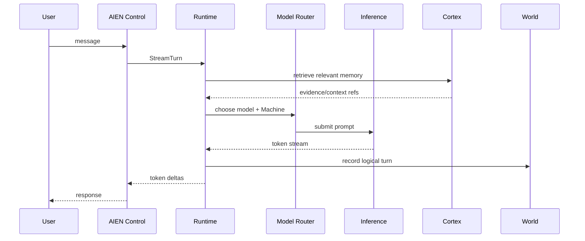

---

## 5.2 Skill/tool turn

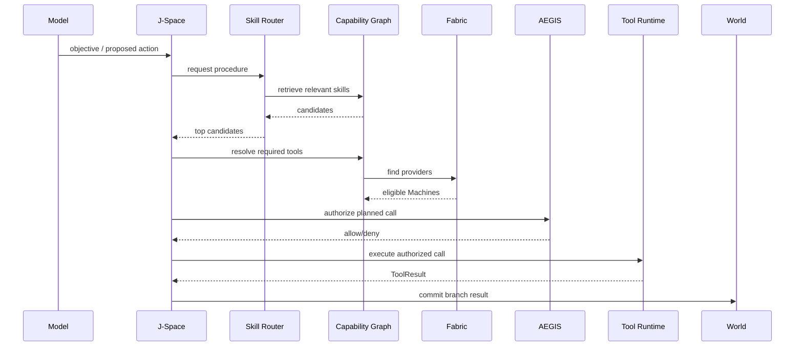

---

## 5.3 External effect turn

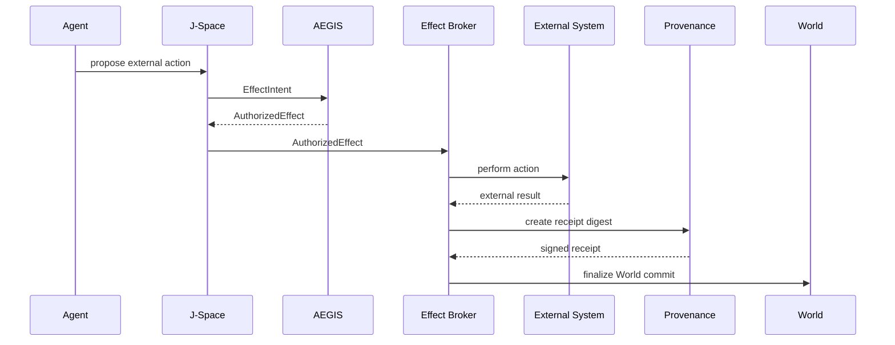

---

# 6. Universal Machine Fabric

## 6.1 Concept

Every physical computer runs:

```text
aien-node
```

A node joins one Fabric and advertises:

- CPU resources,
- accelerator resources,
- memory,
- model cache,
- tools,
- skill implementations,
- operating-system capabilities,
- network quality,
- current load,
- thermal/power state.

Machines are generic logical identities:

```text
Machine 1
Machine 2
Machine 3
Machine 4
...
```

Example:

```text
Machine 1
  CPU architecture: arm64
  accelerator: GPU
  unified memory: true
  memory: 128 GiB
  cached models: A, B

Machine 2
  CPU architecture: arm64
  accelerator: GPU
  memory: 48 GiB
  cached models: B, C

Machine 3
  CPU architecture: x86_64
  accelerator: none
  memory: 64 GiB
  tools: build, git, database

Machine 4
  CPU architecture: arm64
  accelerator: GPU
  tools: platform-specific-build
```

No higher layer should need to know product names.

---

## 6.2 Node capability structure

```rust
pub struct NodeAdvertisement {
    pub machine: MachineId,
    pub identity: WorkloadIdentity,
    pub hardware: HardwareCapabilities,
    pub accelerators: Vec<AcceleratorCaps>,
    pub tools: Vec<ToolProvider>,
    pub skills: Vec<SkillProvider>,
    pub models: Vec<ModelDigest>,
    pub resources: ResourceState,
    pub network: NetworkState,
}
```

---

## 6.3 Transport

Recommended initial transport:

- QUIC
- Rust `quinn`
- TLS 1.3
- mutually authenticated node identity
- multiplexed control/data streams
- optional datagrams for telemetry/heartbeats.

Why QUIC:

- encrypted by default,
- stream multiplexing,
- no TCP head-of-line blocking across independent streams,
- portable across Linux/macOS/Windows,
- pure Rust implementation available.

For LAN discovery:

- mDNS/DNS-SD.

For more advanced direct peer connectivity later:

- Iroh or libp2p concepts can be adopted selectively.

Do not begin with a complicated WAN peer-to-peer overlay.

---

## 6.4 Network topology model

```rust
pub struct FabricLink {
    pub from: MachineId,
    pub to: MachineId,
    pub latency_us: u64,
    pub jitter_us: u64,
    pub bandwidth_bps: u64,
    pub loss_ppm: u32,
    pub transport: TransportClass,
}
```

The scheduler should maintain a weighted graph.

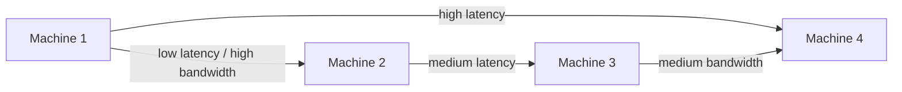

---

## 6.5 Preferred distributed work granularity

### Best over normal LAN/Wi-Fi

- independent J-Space branches,
- tool execution,
- verifier work,
- speculative candidates,
- embeddings,
- compilation/tests,
- document processing,
- model replicas.

### Use only on very fast interconnects

- tensor parallelism,
- layer pipeline parallelism,
- fine-grained activation transfer.

This is crucial.

A slow Machine can help the Fabric if it receives coarse work.

It can hurt the Fabric if every token depends on it.

---

# 7. Portable Accelerator Architecture: No CUDA Dependency

## 7.1 Requirement

AIEN core must not contain a mandatory CUDA dependency.

NVIDIA hardware may use NVIDIA drivers under a portable runtime, but AIEN's source/runtime contracts should not be CUDA-shaped.

---

## 7.2 Target interface

```rust
pub trait Accelerator: Send + Sync {
    fn capabilities(&self) -> DeviceCapabilities;

    fn load_model(
        &mut self,
        capsule: &ModelCapsule,
    ) -> Result<ModelHandle>;

    fn submit(
        &mut self,
        plan: &ExecutionPlan,
    ) -> Result<ExecutionFence>;

    fn fork_kv(
        &mut self,
        parent: SequenceId,
        child: SequenceId,
    ) -> Result<()>;

    fn reclaim(
        &mut self,
        sequence: SequenceId,
    ) -> Result<()>;
}
```

---

## 7.3 Backend strategy

### Tier 1: optimized CPU

Always available.

- x86-64 SIMD
- arm64 SIMD
- multithreaded
- quantized kernels

### Tier 2: Mojo accelerator

Primary portable accelerator path where supported.

Target:

- NVIDIA GPU
- AMD GPU
- Apple GPU

### Tier 3: broad GPU fallback later

If needed, investigate IREE/Vulkan for hardware not covered well by Mojo.

IREE's Vulkan deployment supports multiple GPU vendors and operating systems, but should be treated as an optional portability layer, not another mandatory runtime.

---

## 7.4 Do not expose vendor-specific APIs to the scheduler

Bad:

```rust
if gpu.is_blackwell() { ... }
```

Good:

```rust
if caps.fp4 && plan.supports_fp4() { ... }
else if caps.bf16 { ... }
else { ... }
```

---

# 8. Model Capsules

## 8.1 Why

The runtime should not parse arbitrary model repositories and reshape thousands of tensors on every startup.

Model installation should be a compile/pack phase.

```text
source model
   ↓
aien model pack
   ↓
validated Model Capsule
   ↓
content-addressed chunks
   ↓
runtime-ready
```

---

## 8.2 Capsule contents

```rust
pub struct ModelCapsuleManifest {
    pub model_digest: Digest32,
    pub architecture: ArchitectureId,
    pub tokenizer_digest: Digest32,
    pub template_digest: Digest32,
    pub config_digest: Digest32,

    pub max_context: u32,
    pub tensor_layout: TensorLayoutVersion,
    pub quantization: QuantizationSpec,

    pub shards: Vec<ShardRef>,
    pub required_kernels: Vec<KernelCapability>,
}
```

---

## 8.3 Distribution

Model data should be split into content-addressed chunks.

```text
Model A
├── chunk 000 -> digest
├── chunk 001 -> digest
├── chunk 002 -> digest
└── ...
```

When Machine 3 joins:

```text
Machine 3 already has 73% of Model A.
Transfer only missing chunks.
```

Content-addressed transfer could initially be built over the same QUIC fabric.

Later, `iroh-blobs`-style verified chunk streaming is useful prior art.

---

## 8.4 Persistent prompt roots

Common AIEN system prompts should be tokenized and prefixed once.

```text
model + tokenizer + chat template + system prompt + policy
                         ↓
                    PrefixRootId
```

New sessions fork from the prefix root.

This uses AIEN's branch-native KV architecture to avoid repeated prefill.

---

# 9. Sequence/KV Architecture

## 9.1 Canonical state

```text
SequenceId
  ├── token lineage
  ├── KV block table
  ├── parent sequence
  ├── model handle
  └── owning Machine
```

A fork should:

- copy metadata,
- increment block references,
- share physical prefix pages,
- perform copy-on-write only when divergence requires it.

---

## 9.2 Global vs local identity

A Sequence ID may be globally known.

The actual KV pages remain local to their owning Machine.

```text
Sequence 981
owner = Machine 2
prefix = PrefixRoot 12
world = World 771
```

If Machine 2 disappears, AIEN reconstructs from durable token lineage and model identity.

Do not implement distributed shared memory for KV.

---

# 10. J-Space

## 10.1 Definition

J-Space is the **typed evaluation/search space over possible World transitions**.

It is not:

- a memory database,
- a replacement for WorldStore,
- a replacement for Cortex,
- an arbitrary graph database,
- a token-level tree that always runs.

It exists when AIEN has multiple plausible choices and needs to compare them.

---

## 10.2 Core node

```rust
pub struct JNode {
    pub id: JNodeId,
    pub parent: Option<JNodeId>,

    pub world: WorldId,
    pub sequence: SequenceId,
    pub memory_view: MemoryViewId,

    pub proposal: ProposalRef,
    pub score: ScoreVector,
    pub constraints: ConstraintState,

    pub evidence_root: Digest32,
    pub evaluator_set: EvaluatorSetId,
    pub status: JNodeStatus,
}
```

---

## 10.3 Multi-objective score

Do not collapse everything into one untraceable scalar.

```rust
pub struct ScoreVector {
    pub task_quality: f32,
    pub verifier_confidence: f32,
    pub safety_margin: f32,
    pub latency_cost: f32,
    pub compute_cost: f32,
    pub memory_cost: f32,
    pub uncertainty: f32,
}
```

Pareto filtering can remove dominated candidates before expensive judges run.

---

## 10.4 J-Space flow

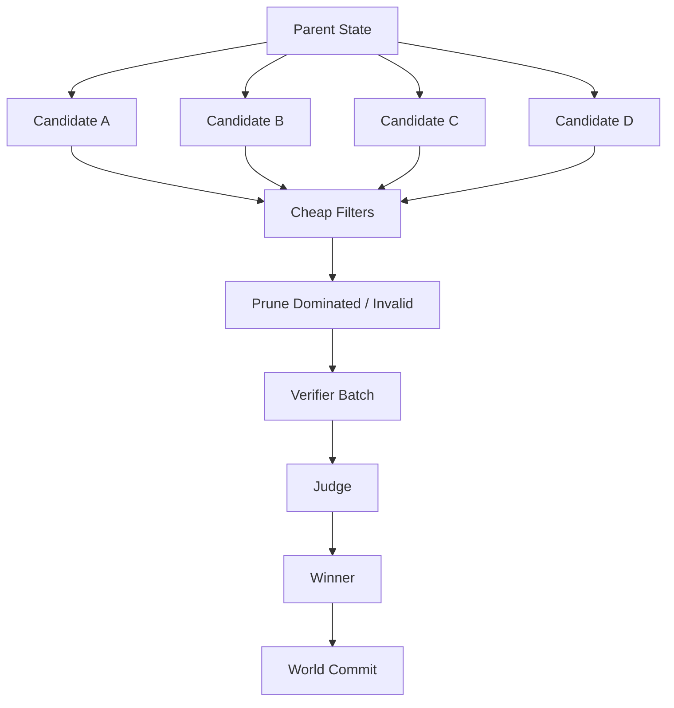

---

## 10.5 Fabric-aware J-Space

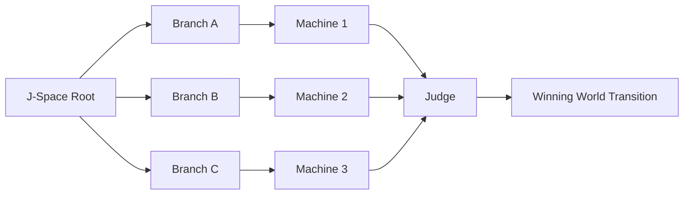

This is a major potential differentiator.

Most distributed inference systems focus on splitting one model computation.

AIEN can distribute **reasoning alternatives and executable Worlds**.

---

# 11. Capability Graph

## 11.1 Purpose

The Capability Graph answers:

> What can AIEN do, what does it require, where can it run, what effects can it cause, and what can satisfy this request?

A flat hash map will not scale.

---

## 11.2 Canonical names

Tools:

```text
filesystem.read
filesystem.write

process.execute

git.status
git.diff
git.commit
git.push

github.issue.read
github.pull_request.create

mail.read
mail.send

memory.cortex.search
memory.cortex.write

database.query

browser.navigate
browser.extract

build.rust
test.rust
build.apple
```

Skills:

```text
software.debug.rust
software.implement.feature
software.review.pull_request
research.deep
communication.answer_email
operations.release
```

---

## 11.3 Skill descriptor

```rust
pub struct SkillDescriptor {
    pub id: SkillId,
    pub name: CanonicalName,
    pub version: Version,

    pub description: String,
    pub domain: DomainId,
    pub family: SkillFamilyId,
    pub tags: Vec<Tag>,
    pub intents: Vec<Intent>,

    pub required_tools: Vec<ToolRequirement>,
    pub required_capabilities: CapabilitySet,

    pub input_schema: SchemaId,
    pub output_schema: SchemaId,

    pub potential_effects: EffectSet,
    pub cost_profile: CostProfile,
    pub examples: Vec<ExampleId>,

    pub digest: Digest32,
}
```

---

## 11.4 Tool descriptor

```rust
pub struct ToolDescriptor {
    pub id: ToolId,
    pub name: CanonicalName,
    pub version: Version,

    pub input_schema: SchemaId,
    pub output_schema: SchemaId,

    pub effects: EffectSet,
    pub requirements: ResourceRequirements,

    pub deterministic: bool,
    pub retryable: bool,
    pub idempotency: IdempotencyClass,
}
```

---

# 12. Skill Router

## 12.1 The routing problem

If AIEN eventually has 10,000 capabilities, sending all of them into the model context is inefficient and harms tool selection.

A 2026 paper on semantic MCP tool discovery reports strong results from retrieving only a few relevant tools instead of presenting the entire catalog, with large token savings and high retrieval hit rates.

The principle is sound even if AIEN develops its own benchmark.

---

## 12.2 Progressive routing

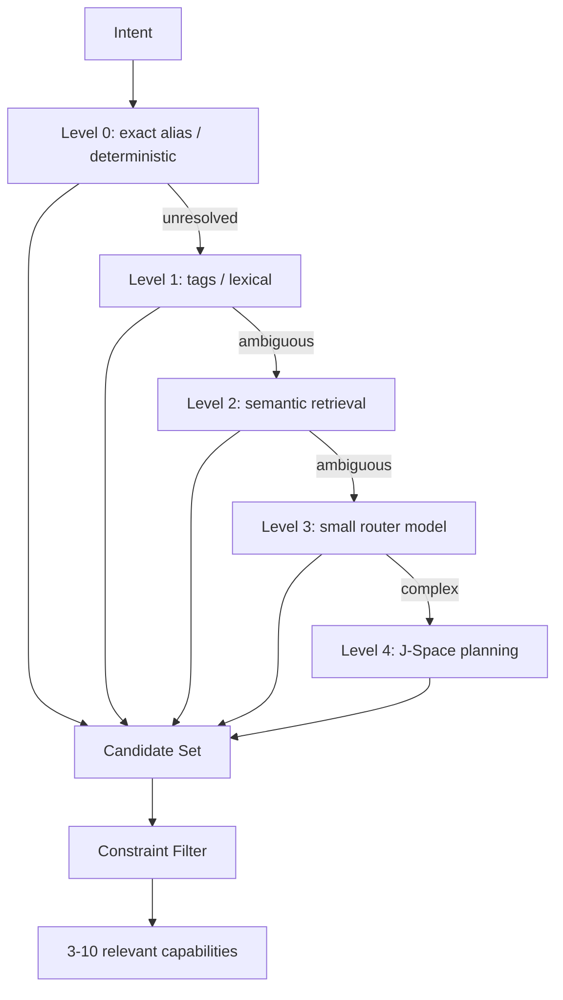

Most requests should stop before the expensive levels.

---

## 12.3 Constraint filtering

Before the model sees candidates, eliminate impossible choices:

- unavailable Machine,
- missing operating-system capability,
- missing credential,
- denied policy,
- incompatible model,
- excessive memory,
- excessive latency,
- tool not installed,
- offline remote provider.

---

## 12.4 Historical routing feedback

Cortex may store routing experience:

```text
request class
selected skill
Machine placement
latency
success/failure
judge score
operator correction
```

Cortex informs ranking.

It does **not** become the authoritative capability registry.

---

# 13. Skill Packs

Human operators need a manageable abstraction above individual tools.

Example packs:

```text
AIEN Base
├── filesystem
├── process
├── memory
└── network

Developer Pack
├── git
├── repository hosting
├── compilation
├── testing
└── debugging

Research Pack
├── web
├── papers
├── citations
└── synthesis

Communication Pack
├── mail
├── calendar
└── messaging

Platform Build Pack
├── native build tools
├── simulator
└── signing
```

A Machine may advertise entire packs plus individual exceptions.

---

# 14. MCP Architecture

## 14.1 What MCP is

MCP is a protocol that lets AI clients communicate with servers exposing:

- tools,
- resources,
- prompts,
- and related capabilities.

It does not require Python or TypeScript.

The official Rust MCP SDK (`rmcp`) is current, async, and supports both client and server use.

---

## 14.2 Current AIEN MCP state

### Implemented

`spark-debugger`:
- Rust
- stdio
- JSON-RPC
- initialize
- tools/list
- tools/call

`aien-harness`:
- Rust
- stdio
- JSON-RPC
- initialize
- tools/list
- tools/call

### Problem

These are separate hand-maintained protocol implementations.

---

## 14.3 Target MCP subsystem

Canonical source location:

```text
aien-sovereign-core/crates/aien-mcp
```

The existing hand-written MCP servers remain compatibility fixtures during migration; canonical protocol/client/broker behavior moves into this crate.

```text
aien-mcp
├── client
├── server
├── broker
├── registry
├── stdio transport
├── streamable HTTP transport
├── auth
├── vault credential provider
├── AEGIS adapter
├── Capability Graph adapter
├── Fabric adapter
└── provenance adapter
```

Use official `rmcp` rather than expanding manual JSON-RPC matching.

Session ownership and effect authority are Decision 6. `aien-mcp` owns the connection. The Effect Broker is the only caller of an irreversible `tools/call`, and only with an `AuthorizedEffect`.

---

## 14.4 MCP is translated into AIEN capabilities

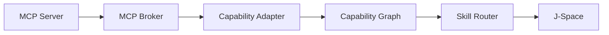

The inverse direction allows AIEN-native tools to be exported as MCP when external clients need them.

---

# 15. Secret Architecture

## 15.1 Model must never see raw credentials

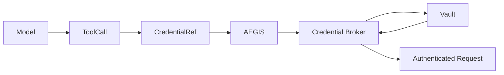

The model receives:

```text
CredentialRef("service.operator")
```

not:

```text
actual-secret-value
```

---

## 15.2 Production vault policy

```rust
pub enum SecretPolicy {
    VaultOnly,
    VaultThenEnvironmentForDevelopment,
}
```

Production must reject implicit environment fallback.

A third-party process that explicitly requires an environment variable may receive a **call-scoped child-only injection** from a `CredentialRef`, after AEGIS authorization and Fabric placement. This is a compatibility delivery mechanism, not a configuration source. Raw values must never be serialized into AIEN configuration, World state, J-Space, logs, Cortex, or provenance.

---

## 15.3 Network identity

For Fabric identity, study and borrow from SPIFFE/SPIRE:

- workload identity,
- short-lived credentials,
- runtime attestation,
- mTLS.

AIEN does not necessarily need to deploy full SPIRE initially.

A small AIEN-native identity layer can use the same principles:

```text
Machine identity key
    ↓
node enrollment
    ↓
short-lived session certificate
    ↓
mTLS/QUIC peer authentication
```

---

# 16. AEGIS Authorization Architecture

AEGIS should evolve from pattern checks into a typed authorization plane.

Recommended combination:

1. deterministic hard invariants,
2. Cedar-style declarative policy,
3. optional semantic/probe evaluation,
4. operator approval for high-risk effects.

Cedar is especially attractive because:

- it is written in Rust,
- separates policy from application logic,
- supports principal/action/resource/context decisions,
- is designed for fast authorization.

Example conceptual request:

```text
principal = Agent::"researcher-17"
action    = Tool::"mail.send"
resource  = RecipientDomain::"external"
context   = {
  world_id,
  skill_id,
  jnode_id,
  operator_session,
  risk_score
}
```

---

# 17. Effect Broker

## 17.1 Why a separate process

If all external effects are available directly inside `aien-runtime`, a bug can bypass policy.

The stronger design is:

```text
aien-runtime
  no unrestricted external effects
        │
        │ authorized typed UDS/QUIC
        ▼
aien-effect-broker
        │
        ▼
external systems
```

The broker is small enough to audit aggressively.

---

## 17.2 Effect types

```rust
pub enum ExternalEffect {
    SendMessage,
    PublishGit,
    Deploy,
    Purchase,
    DeleteRemoteResource,
    ModifyExternalRecord,
}
```

Local reversible operations can remain World-local.

---

## 17.3 Typestate

```text
EffectIntent<T>
     ↓
CheckedEffect<T>
     ↓
AuthorizedEffect<T>
     ↓
ExecutedEffect<T>
     ↓
CommittedEffect<T>
```

An SMTP or Git-push implementation should accept only `AuthorizedEffect<T>`.

---

# 18. World Architecture

## 18.1 Purpose

World = branchable, transactional execution state.

A World references:

- object root,
- filesystem root,
- token root,
- memory view,
- capability set,
- effect intents,
- lineage.

---

## 18.2 Target World commit

```rust
pub struct WorldCommit {
    pub world: WorldId,
    pub parent: Option<WorldCommitId>,
    pub sequence_number: u64,

    pub object_root: Digest32,
    pub filesystem_root: Digest32,
    pub token_root: Digest32,
    pub memory_root: Digest32,

    pub effects_root: Digest32,
    pub evidence_root: Digest32,

    pub model_digest: Digest32,
    pub tokenizer_digest: Digest32,
    pub policy_digest: Digest32,
    pub runtime_build_digest: Digest32,

    pub jspace_decision: Option<JDecisionId>,

    pub signer: SignerIdentity,
    pub signature: Signature,
}
```

---

# 19. Signed Provenance

## 19.1 Reuse existing AIEN protocol code

AIEN already has:

- P-256 signers,
- TPM signer concepts,
- evaluation receipts,
- Merkle roots.

Do not create a second unrelated format.

---

## 19.2 DSSE/in-toto-compatible envelope

Borrow the DSSE principle:

- authenticate payload type,
- authenticate payload bytes,
- avoid fragile canonicalization assumptions,
- allow multiple signatures.

This improves interoperability with broader provenance tooling.

---

## 19.3 Do not hardware-sign every event

Use:

1. short-lived in-memory session signer,
2. Merkle-batched commits,
3. periodic hardware-rooted checkpoint.

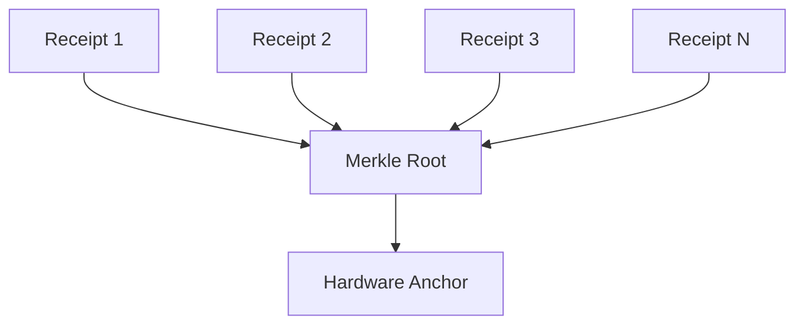

This avoids making hardware signing the latency bottleneck.

---

# 20. Cortex Memory Integration

## 20.1 Memory planes

Recommended memory layers:

### Working memory
Current sequence / World-local state.

### Episodic memory
Sessions, actions, outcomes, failures.

### Semantic memory
Entities, claims, stable facts.

### Procedural memory
Skill routing outcomes, successful plans, reusable tactics.

### Provenance memory
Evidence and signed receipts.

---

## 20.2 Memory flow

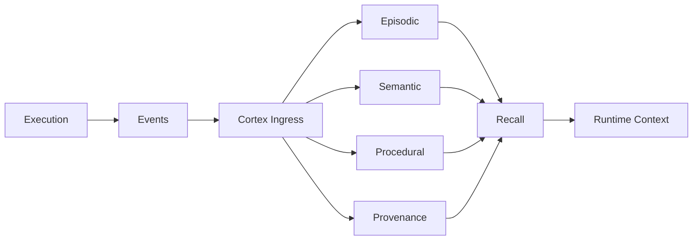

---

# 21. Durable Workflows

Some AIEN tasks may last minutes, hours, or days.

Temporal demonstrates the value of durable execution that resumes after process/network failure.

AIEN does not have to embed Temporal itself, especially if the objective is a compact local Rust stack.

But it should adopt the same key pattern:

```text
workflow state
+ deterministic transition
+ append-only event log
+ replay
+ idempotent activity
```

The Harness already moves in this direction.

Recommended new core:

```rust
pub trait DurableWorkflow {
    type State;
    type Event;

    fn apply(state: &mut Self::State, event: &Self::Event);
}
```

All irreversible activities emit receipts and can be re-associated during replay.

---

# 22. Plugin and Third-Party Tool Isolation

Native Rust tools are fastest, but third-party extensions cannot all be trusted.

Use Wasmtime/WASI Component Model as an optional sandboxed plugin class.

Why:

- portable,
- cross-language,
- explicit imports/exports,
- restricted filesystem/network capabilities,
- embeddable in Rust.

Architecture:

```text
Tool package
   ↓
trusted native?
   ├── yes -> NativeToolExecutor
   └── no  -> WASM Component Executor
                     ↓
                capability grants
```

MCP tools and process tools should also execute under explicit capability restrictions.

---

# 23. Observability

Adopt OpenTelemetry concepts rather than inventing unrelated metric names.

AIEN should emit:

- traces,
- metrics,
- structured events,
- profiling data.

Key dimensions:

```text
machine.id
world.id
sequence.id
jspace.id
jnode.id
skill.id
tool.id
model.digest
accelerator.class
effect.class
policy.decision
```

Never record sensitive prompt/tool content by default.

Content logging must be opt-in.

---

# 24. RSI Integration

RSI should consume telemetry and benchmark evidence.

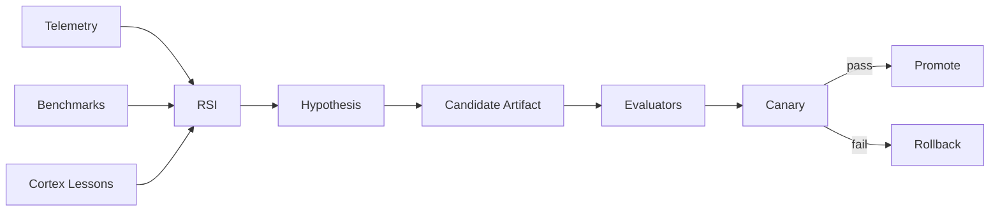

RSI may optimize:

- skill retrieval,
- scheduling,
- placement,
- batch widths,
- J-Space pruning thresholds,
- kernel plans,
- model quantization choice,
- cache policy.

---

# 25. Market Gap Analysis

The market contains strong products for individual layers, but the combination AIEN is targeting remains unusual.

## Gap 1: Universal heterogeneous AI fabric

### Existing approaches

- Exo: automatic device discovery and heterogeneous local model partitioning.
- llama.cpp RPC: exposes remote compute devices and distributes model/KV state.
- MLX distributed: serious multi-machine communication including low-latency interconnects.
- Ray/Dask: mature heterogeneous resource scheduling.

### What they solve

They prove that:

- heterogeneous local clusters are practical,
- resource-aware scheduling works,
- remote accelerators can contribute,
- topology matters.

### Remaining market gap

A local fabric that combines:

- inference,
- agent branches,
- tools,
- skills,
- state Worlds,
- safety policy,
- provenance,
- memory,
- and self-improvement

under one typed runtime.

### AIEN implementation

Build `aien-fabric` in Rust.

Start with coarse-grained work:

- J-Space branches,
- tool execution,
- model replicas.

Add tensor/model sharding only after topology metrics prove it is worthwhile.

---

## Gap 2: Skill routing at very large capability counts

### Existing approaches

Agent frameworks typically expose tool lists and workflows.

MCP standardizes tool discovery.

Research now demonstrates semantic retrieval for large MCP tool catalogs.

### Remaining gap

A router that combines:

- semantic relevance,
- hard capability requirements,
- current Machine availability,
- AEGIS policy,
- secrets availability,
- historical success,
- model requirements,
- latency and cost.

### AIEN implementation

Build `aien-capability` + `aien-skill-router`.

Use multi-stage routing:

1. deterministic alias,
2. metadata,
3. lexical,
4. embedding,
5. small router model,
6. J-Space.

This is a real differentiator because routing is tied to execution reality, not just textual similarity.

---

## Gap 3: Secure MCP as a capability adapter

### Existing approaches

The official Rust MCP SDK supports current MCP client/server behavior and authentication features.

### AIEN current state

Two hand-written Rust MCP servers already exist.

### Remaining gap

A single broker where:

- MCP tools become AIEN capabilities,
- credentials remain vault handles,
- AEGIS gates calls,
- Fabric can place calls,
- World/provenance wraps results.

### AIEN implementation

Build `aien-mcp` around `rmcp`.

Retire duplicate protocol loops after migration.

---

## Gap 4: Portable accelerator runtime without CUDA-shaped architecture

### Existing approaches

- Mojo provides portable accelerator programming across supported GPU families.
- IREE/Vulkan provides broad vendor/OS coverage.
- llama.cpp/ggml supports many hardware backends.

### Remaining gap

A branch-native agent runtime whose core scheduler/KV/World logic is hardware-independent while high-performance kernels remain portable.

### AIEN implementation

Rust control plane + Mojo kernels + optimized CPU.

IREE/Vulkan can be evaluated later for unsupported accelerator classes.

No mandatory CUDA build dependency.

---

## Gap 5: Branch-native test-time search with executable state

### Existing approaches

Research on test-time scaling shows value from:

- candidate sampling,
- verification,
- search over partial states,
- inference-time verification.

Inference servers already implement prefix reuse.

### Remaining gap

Most systems treat candidates as text completions.

AIEN can treat them as:

```text
Sequence
+ World
+ memory view
+ tool plan
+ evidence
+ policy state
```

### AIEN implementation

Build J-Space as first-class typed state.

This may be AIEN's strongest technical differentiator.

---

## Gap 6: Effect-aware agent transactions

### Existing approaches

Agent SDKs increasingly include sandboxes and tool controls.

Authorization engines such as Cedar provide policy decisions.

### Remaining gap

A local agent runtime in which:

- speculative branches do not leak effects,
- external actions require typed authorization,
- the effect boundary is non-bypassable,
- the resulting World commit is signed.

### AIEN implementation

`aien-effect-broker` + AEGIS + World commits.

---

## Gap 7: Signed, branch-aware agent provenance

### Existing approaches

in-toto/DSSE provides strong supply-chain attestation patterns.

### Remaining gap

Runtime provenance spanning:

```text
model
→ reasoning branch
→ tools
→ external effect
→ World transition
→ memory
```

### AIEN implementation

Extend current `aien-provenance` and evaluation receipts into World Commit attestations.

---

## Gap 8: Local self-improvement that is actually gated

### Existing approaches

Auto-tuning and agent optimization exist, but safe autonomous promotion remains difficult.

### AIEN current advantage

RSI already has:

- judge,
- canary,
- rollback,
- signed evaluation.

### Remaining gap

Connect it to the full runtime telemetry and signed World evidence without letting RSI mutate the hot path directly.

---

# 26. Competitive Positioning

AIEN should not try to win by saying:

> another agent framework

or:

> another inference server

or:

> another MCP host

Those categories are crowded.

A more defensible technical category is:

> **A universal branch-native AI runtime that turns multiple Machines into one capability-aware local AI system.**

The differentiation stack is:

```text
heterogeneous Fabric
        +
portable inference
        +
branch-native KV
        +
World transactions
        +
J-Space search
        +
Capability Graph
        +
skill routing
        +
MCP compatibility
        +
AEGIS effect safety
        +
signed provenance
        +
Cortex memory
        +
RSI optimization
```

The combination matters more than any individual feature.

---

# 27. Proposed Core Types

```rust
pub struct MachineId(pub [u8; 16]);
pub struct WorldId(pub u64);
pub struct SequenceId(pub u64);
pub struct JSpaceId(pub u64);
pub struct JNodeId(pub u64);
pub struct SkillId(pub Digest32);
pub struct ToolId(pub Digest32);
pub struct ModelDigest(pub Digest32);
pub struct ReceiptId(pub Digest32);
```

Everything crossing process or Machine boundaries should use stable typed IDs.

---

# 28. Suggested Crate Responsibilities

## `aien-capability`

Owns:

- tool/skill descriptors,
- capability IDs,
- schemas,
- requirements,
- effect classes.

Does not execute.

---

## `aien-skill-router`

Owns:

- indexes,
- retrieval,
- ranking,
- constraint filtering,
- routing telemetry.

Does not perform effects.

---

## `aien-tool-runtime`

Owns:

- native Rust executor,
- WASM executor,
- process adapter,
- HTTP adapter.

Does not authorize.

---

## `aien-mcp`

Owns:

- MCP client/server,
- transport,
- schema translation,
- auth negotiation,
- broker.

Does not own secrets.

---

## `aien-vault`

Owns:

- secret references,
- vault access,
- short-lived secret leases,
- redaction.

Does not expose arbitrary secret strings to models.

---

## `aien-policy`

Owns:

- deterministic invariants,
- Cedar policies,
- probe integration,
- approval requirements.

---

## `aien-effect-broker`

Owns:

- irreversible external side effects.

Small, heavily audited process.

---

## `aien-fabric`

Owns:

- membership,
- node identity,
- topology,
- capability advertisement,
- task placement,
- leases,
- failover.

---

## `aien-jspace`

Owns:

- candidate branches,
- evaluation,
- Pareto pruning,
- judges,
- branch lifecycle.

---

## `aien-world`

Owns:

- branchable transactional state,
- commits,
- lineage,
- rollback roots.

---

# 29. Detailed Implementation Plan

## Phase 0: Establish invariants

Before new features:

1. Declare hardware-neutral interfaces.
2. Declare Tool vs Skill semantics.
3. Declare World vs Cortex vs J-Space separation.
4. Declare vault-only production secrets.
5. Declare that external effects cannot bypass the broker.
6. Declare stable protocol types.

Acceptance:

- architecture tests compile without any vendor-specific type in core scheduler APIs.

---

## Phase 1: Capability Graph

Build:

```text
aien-capability
aien-skill-router
```

Migrate AEGIS `SkillRegistry` definitions into Tool descriptors.

Keep adapters so existing calls continue working.

Acceptance:

- 1,000 synthetic tools indexed.
- routing returns top 5.
- impossible capabilities filtered before model use.
- tool definitions never all enter the context.

---

## Phase 2: Canonical MCP broker

Build `aien-mcp` with `rmcp`.

Import existing:

- debugger MCP tools,
- harness MCP tools.

Acceptance:

- stdio server works.
- stdio client works.
- Streamable HTTP works.
- tools/resources/prompts map into Capability Graph.
- MCP server failure cannot crash runtime.
- credentials are references, not config secrets.

---

## Phase 3: Vault-only production mode

Refactor:

```rust
VaultResolver
```

to explicit policy.

Acceptance:

- production test fails when secret exists only in environment.
- logs never contain resolved value.
- model/tool schemas never contain resolved value.
- secret lease expires/zeroizes where practical.

---

## Phase 4: Effect Broker

Move mail first.

Then Git publish.

Add mock driver for golden-path tests.

Acceptance:

- runtime process cannot execute test external effect directly.
- denied action yields zero broker driver calls.
- allowed action yields one receipt.
- receipt becomes part of World commit.

---

## Phase 5: Signed World commits

Extend `aien-provenance`.

Acceptance:

- every committed external effect has:
  - parent World,
  - effect root,
  - policy digest,
  - runtime build digest,
  - signer identity.
- verification detects tampering.

---

## Phase 6: Model Capsule + portable weight ABI

Replace production `Vec<f32>` weight ownership.

Build:

- typed tensor views,
- quantized storage,
- mmap/chunk loading,
- capsule manifest.

Acceptance:

- large model does not expand all weights to FP32.
- model startup is deterministic and fingerprinted.
- same capsule works across at least CPU and one accelerator implementation.

---

## Phase 7: Portable accelerator

Build/finish:

- optimized CPU kernels,
- Mojo batch kernels,
- paged attention,
- quantized matmul,
- sampling.

Retain old accelerator path only as comparison until parity/performance is proven.

Acceptance:

- no mandatory CUDA toolkit dependency.
- CPU path passes oracle tests.
- Mojo path passes parity.
- unsupported hardware fails clearly or uses CPU.

---

## Phase 8: `aien-node` + Fabric

Build:

- Machine identity,
- mDNS discovery,
- QUIC control transport,
- capability advertisement,
- topology probes,
- work leases.

Acceptance:

- Machine 2 can join Machine 1 automatically.
- Machine 2 disappears; work lease expires and reschedules.
- all control traffic is mutually authenticated.

---

## Phase 9: Distributed branch execution

Before distributed tensor parallelism, dispatch J-Space branches.

Acceptance:

```text
Machine 1 creates 4 candidate branches.
Machine 2 executes branch 2.
Machine 3 executes branch 3.
All results return with signed evidence.
Judge chooses winner.
Non-winning Worlds are reclaimed.
```

---

## Phase 10: J-Space

Build first version using meaningful decision boundaries, not token-by-token MCTS.

Acceptance:

- branch candidate state references World/Sequence IDs rather than cloning.
- cheap filters remove invalid branches.
- judge outcome is reproducible.
- effects cannot occur on speculative branches.
- winner can commit atomically.

---

## Phase 11: Content-addressed model distribution

Chunk Model Capsules.

Acceptance:

- second Machine only downloads missing chunks.
- chunks verify by digest.
- corrupted chunk is rejected.
- model cache survives restart.

---

## Phase 12: Fine-grained distributed inference

Only now investigate:

- layer pipeline parallelism,
- tensor parallelism,
- speculative cross-Machine decode,
- RDMA.

Enable only where measured topology predicts a gain.

---

# 30. Benchmark Plan

AIEN needs metrics that measure the system it is actually trying to build.

## Inference

- prompt tokens/sec
- decode tokens/sec
- TTFT
- inter-token latency
- GPU/accelerator utilization
- memory amplification
- KV bytes copied
- prefix reuse ratio

## J-Space

- candidates/sec
- time-to-best-valid-answer
- branches explored
- branches pruned
- verifier latency
- winner quality
- KV sharing ratio
- memory per branch

## Fabric

- discovery time
- Machine join latency
- control RTT
- bandwidth
- failover latency
- work migration time
- model chunk reuse
- scheduler placement quality

## Skills/tools

- routing latency
- top-k hit rate
- tool schema token count
- task success rate
- wrong-tool rate
- policy-denial rate

## Provenance/security

- signing overhead
- verification overhead
- broker overhead
- policy latency
- bypass tests
- secret exposure tests

---

# 31. Golden Path

The final release gate should prove:

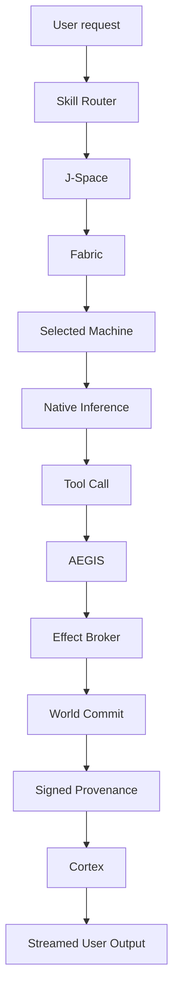

The golden path must use:

- real model,
- real tokenizer,
- real routing,
- real policy,
- real effect boundary,
- real receipt,
- real World commit,
- real Cortex recall/store,
- no simulated bypass assertions.

---

# 32. Failure Model

AIEN must expect:

- Machine departure,
- network partition,
- model unavailable,
- tool provider unavailable,
- MCP server crash,
- secret unavailable,
- policy denial,
- judge disagreement,
- stale World,
- duplicate operation,
- corrupted model chunk,
- accelerator fallback,
- verifier failure.

Every subsystem must have explicit behavior for these cases.

---

# 33. Machine Failure Recovery

A remote branch should be reconstructible from:

```text
model digest
+ token lineage
+ World root
+ memory view
+ tool/evidence refs
```

Do not require remote RAM contents to survive.

Use leases:

```rust
pub struct WorkLease {
    pub task: TaskId,
    pub machine: MachineId,
    pub expires_at: Timestamp,
    pub attempt: u32,
}
```

Expired work can be rescheduled.

External effects use idempotency keys and must never be blindly replayed.

---

# 34. What Not to Build

Avoid the following:

## Distributed shared memory

Do not pretend network RAM is local RAM.

## One giant “AIEN database”

Do not merge World, Cortex, J-Space, tools, and telemetry into one table system.

## All-tools-in-prompt

Do not put thousands of tool schemas into context.

## Model-owned secrets

Do not expose raw API credentials to prompts or model-visible tool arguments.

## Direct effects from speculative branches

Only winning, authorized transactions may externalize.

## Hardware-vendor logic in the core scheduler

Hardware is capability metadata.

## Hand-maintaining the entire MCP protocol

Use the official Rust SDK.

## Fine-grained distributed inference over poor networks

Prefer branch-level work unless topology supports finer partitioning.

---

# 35. Recommended Technology Adoption Matrix

| Need | Adopt / Study | AIEN Role |
|---|---|---|
| MCP protocol | official Rust `rmcp` | compatibility broker |
| Fine-grained authorization | Cedar | policy engine under AEGIS |
| Workload identity concepts | SPIFFE/SPIRE | Fabric identity design |
| QUIC | Quinn | initial Fabric transport |
| P2P/content distribution | Iroh concepts | later model chunk distribution |
| Sandboxed plugins | Wasmtime/WASI | third-party tool runtime |
| Broad GPU fallback | IREE/Vulkan | optional later backend |
| Local distributed inference patterns | Exo, llama.cpp RPC, MLX | topology/partitioning prior art |
| General resource scheduling | Ray/Dask patterns | scheduling prior art, not runtime dependency |
| Durable execution | Temporal patterns | event/replay semantics |
| Provenance envelope | in-toto/DSSE | signed World envelope compatibility |
| Observability | OpenTelemetry | trace/metric semantics |

---

# 36. What AIEN Should Build Itself

The following are core differentiators and should not be outsourced wholesale:

1. **World abstraction**
2. **J-Space**
3. **branch-native Sequence/KV lifecycle**
4. **Capability Graph**
5. **Skill Router**
6. **AIEN Fabric scheduling semantics**
7. **effect transaction model**
8. **World-integrated provenance**
9. **Cortex/World/J-Space integration**
10. **RSI optimization loop**

Use external libraries for protocols and primitives.

Own the AIEN semantics.

---

# 37. Flagship Technical Story

A compelling demonstration of the complete architecture would be:

```text
1. Machine 1 starts AIEN.
2. Machine 2 joins.
3. Machine 3 joins.
4. Capability Graph updates automatically.
5. A user asks AIEN to solve a complex task.
6. J-Space generates multiple strategies.
7. Branches execute on different Machines.
8. One Machine runs a platform-specific tool unavailable elsewhere.
9. An MCP tool is dynamically routed through the broker.
10. No model sees a raw secret.
11. AEGIS blocks one unsafe branch.
12. The judge selects the best valid branch.
13. The Effect Broker performs the approved external action.
14. A signed World commit proves the result.
15. Cortex stores the lesson.
16. RSI records whether the routing/placement could be improved.
17. One Machine disconnects.
18. AIEN continues running.
```

That demonstration communicates the architecture much better than a synthetic chat benchmark.

---

# 38. Short Architecture Reference

```text
USER / API
    ↓
CONTROL PLANE
    ↓
RUNTIME
    ↓
J-SPACE
    ↓
SKILL ROUTER
    ↓
CAPABILITY GRAPH
    ↓
FABRIC SCHEDULER
    ↓
MACHINE 1 / MACHINE 2 / MACHINE 3 / ...
    ↓
TOOL / MODEL / VERIFIER EXECUTION
    ↓
AEGIS
    ↓
EFFECT BROKER
    ↓
WORLD COMMIT
    ↓
SIGNED PROVENANCE
    ↓
CORTEX
    ↓
RSI / BENCHMARK FEEDBACK
```

---

# 39. Priority Order

If the goal is to maximize architectural leverage, build in this order:

1. **Capability ABI**
2. **Skill Router**
3. **Canonical Rust MCP broker**
4. **Vault-only production secret policy**
5. **Effect Broker**
6. **Signed World Commit**
7. **Model Capsule / typed weight ABI**
8. **Portable accelerator interface**
9. **aien-node / Fabric**
10. **distributed branch execution**
11. **J-Space**
12. **content-addressed model distribution**
13. **fine-grained distributed inference**
14. **RSI optimization across all of the above**

This ordering creates useful product value at every stage.

---

# 40. Gap Summary

## Already strong

- native Rust runtime
- scheduler
- branchable inference state
- KV sharing
- streaming
- Cortex
- AEGIS
- evaluation/provenance primitives
- RSI canary/rollback
- Rust MCP proofs
- benchmark culture

## Partial / fragmented

- MCP
- skills/tools
- secrets
- effect gating
- provenance
- model loading
- hardware abstraction
- operator composition

## Missing or not yet first-class

- Capability Graph
- Skill Router
- Fabric
- Machine identity and placement
- Model Capsule
- portable accelerator contract
- signed World commits
- non-bypassable Effect Broker
- J-Space
- distributed branch execution
- content-addressed model distribution
- one canonical observability schema

---

# 41. Final Architectural Definition

AIEN should ultimately be understood as:

> **A universal, branch-native AI runtime that treats models, tools, skills, memory, machines, and accelerators as discoverable capabilities inside one secure local compute fabric. It can explore multiple Worlds in parallel, judge them in J-Space, execute approved effects through a non-bypassable policy boundary, prove resulting state transitions cryptographically, remember useful outcomes in Cortex, and improve its own routing and execution through gated RSI.**

The most important implementation discipline is to keep these responsibilities separate:

```text
Model      → proposes
J-Space    → compares
Skill      → describes procedure
Tool       → performs atomic operation
Router     → finds capability
Fabric     → finds Machine
AEGIS      → authorizes
Broker     → performs effect
World      → records state
Provenance → proves
Cortex     → remembers
RSI        → improves
```

That separation is the architecture.

---

# 42. Research Sources and Prior Art

The following current sources informed the gap analysis and implementation choices.

## AIEN repositories

- Sovereign Manifesto: https://github.com/aien-dev/open-humanity/blob/main/docs/SOVEREIGN_MANIFESTO.md

- https://github.com/aien-dev/aien-sovereign-core
- https://github.com/aien-dev/aien-protocols
- https://github.com/aien-dev/aegis-runtime
- https://github.com/aien-dev/cortex-rs
- https://github.com/aien-dev/spark-rsi
- https://github.com/aien-dev/spark-debugger
- https://github.com/aien-dev/aien-harness
- https://github.com/aien-dev/spark-inquisitor
- https://github.com/aien-dev/spark-hive
- https://github.com/aien-dev/benchmarks
- https://github.com/aien-dev/aien-local-stack

## Distributed compute and inference

- Exo: https://github.com/exo-explore/exo
- llama.cpp RPC: https://github.com/ggml-org/llama.cpp/blob/master/tools/rpc/README.md
- MLX distributed: https://github.com/ml-explore/mlx/blob/main/docs/src/usage/distributed.rst
- Ray scheduling: https://docs.ray.io/en/latest/ray-core/scheduling/
- Dask distributed: https://distributed.dask.org/

## Portable execution

- IREE Vulkan: https://iree.dev/guides/deployment-configurations/gpu-vulkan/
- Wasmtime: https://docs.wasmtime.dev/
- Wasmtime Component Model: https://docs.wasmtime.dev/api/wasmtime/component/

## MCP

- MCP organization: https://github.com/modelcontextprotocol
- Official Rust SDK: https://github.com/modelcontextprotocol/rust-sdk
- Rust SDK docs: https://rust.sdk.modelcontextprotocol.io/

## Authorization and identity

- Cedar: https://github.com/cedar-policy/cedar
- Cedar docs: https://docs.cedarpolicy.com/
- SPIFFE/SPIRE: https://spiffe.io/

## Provenance

- in-toto Attestation: https://github.com/in-toto/attestation
- DSSE envelope concepts: https://github.com/in-toto/attestation/blob/main/spec/v1/envelope.md

## Observability

- OpenTelemetry semantic conventions: https://opentelemetry.io/docs/specs/semconv/
- OpenTelemetry GenAI observability: https://opentelemetry.io/blog/2026/genai-observability/

## Tool routing and test-time scaling

- Semantic MCP tool discovery: https://arxiv.org/abs/2603.20313
- Test-time scaling survey: https://arxiv.org/abs/2608.04001
- Inference-time verification: https://arxiv.org/abs/2601.15808

## Durable execution

- Temporal: https://docs.temporal.io/

---

# 43. Immediate Next Engineering Ticket Set

For implementation agents, the following tickets are concrete enough to start.

## Ticket A: `aien-capability`

Create canonical Tool and Skill descriptors.

Deliver:

- typed IDs,
- schemas,
- effect classes,
- resource requirements,
- version/digest semantics,
- serialization tests.

---

## Ticket B: `aien-skill-router`

Deliver:

- deterministic alias lookup,
- tags/lexical index,
- semantic index interface,
- hard constraint filter,
- top-k output,
- routing receipts.

Benchmark 1,000 / 10,000 capability catalogs.

---

## Ticket C: `aien-mcp`

Use `rmcp`.

Deliver:

- client,
- server,
- stdio,
- Streamable HTTP,
- mapping to ToolDescriptor,
- import existing Debugger/Harness MCP tools.

---

## Ticket D: `aien-vault`

Deliver production `VaultOnly`.

Remove implicit environment fallback from production.

Return `CredentialRef`, not secrets, to callers above broker level.

---

## Ticket E: `aien-effect-broker`

Move mail first.

Then Git publish.

Add mock driver for golden-path tests.

---

## Ticket F: Signed World Commit v1

Extend `aien-provenance`.

Use Merkle roots and existing signer interfaces.

---

## Ticket G: Model Capsule v1

Support:

- TinyLlama for oracle,
- one useful long-context model family,
- typed BF16/quantized tensor views,
- tokenizer/template digest,
- no FP32 expansion in production.

---

## Ticket H: Portable Accelerator v1

Deliver:

- CPU backend,
- Mojo backend,
- backend parity suite,
- no mandatory CUDA build dependency.

---

## Ticket I: Fabric v1

Deliver:

- `aien-node`,
- Machine IDs,
- mDNS discovery,
- QUIC connection,
- identity,
- capability advertisement,
- topology metrics.

---

## Ticket J: Distributed J-Space prototype

Deliver:

- root candidate,
- 3 branches,
- dispatch to multiple Machines,
- cheap verifier,
- winning World commit,
- losing branch cleanup.

This single prototype will test almost every major architectural boundary.

---

# 44. Closing Rule

Whenever a new subsystem is proposed, ask:

1. Is this **state**, **memory**, **planning**, **capability**, **placement**, **policy**, **effect**, or **evidence**?
2. Which existing subsystem already owns that responsibility?
3. Can it be represented as a typed protocol instead of a new daemon?
4. Can it execute on any Machine?
5. Can it fail without corrupting the logical AIEN system?
6. Can its effects be rolled back or proven?
7. Does it improve the end-to-end system, or merely add another layer?

If those questions remain explicit, AIEN can grow to a very large system without becoming an unmaintainable collection of overlapping agents and services.
